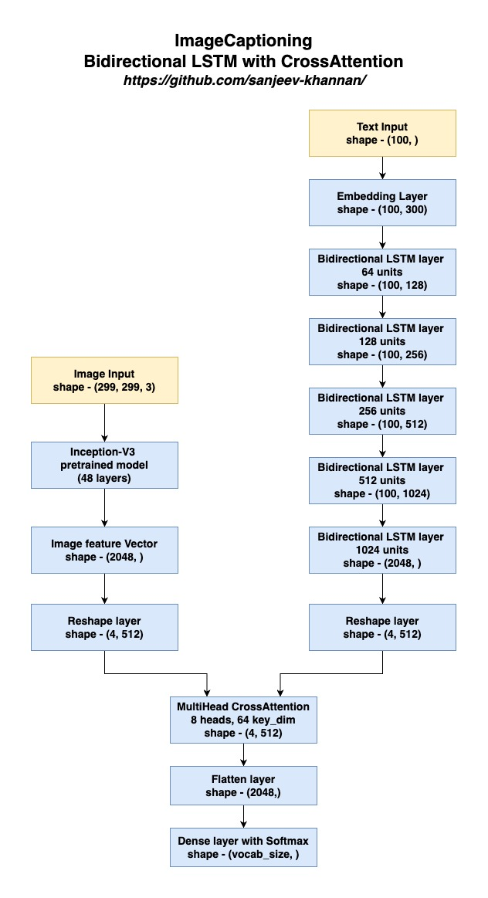

# Image Captioning with Multi-Modal CrossAttention 

Welcome to my image captioning project! I've built a model that combines both visual and textual data using a multi-modal cross_attention mechanism. This model, which has around 70 million parameters, generates relevant and context-aware captions for images.

I've used InceptionV3 pretrained network for image feature extraction and Bidirectional LSTMs for text feature extraction. 

## Dataset

The dataset used for this project is the Flickr Image Dataset, which can be downloaded from [Kaggle](https://www.kaggle.com/datasets/hsankesara/flickr-image-dataset). This dataset contains images along with multiple captions describing each image.

## System Requirements

To train and run the image captioning model effectively, the following system requirements are recommended:

- **Python Version**: 3.7 or higher
- **RAM**: At least 16GB
- **GPU**: Minimum 8GB GPU memory with CUDA cores
- **GPU Driver**: Latest NVIDIA driver with CUDA support
- **Storage**: At least 20GB of free disk space for dataset and model checkpoints

I trained this model on Kaggle notebooks with an NVIDIA P100 GPU (16GB GPU memory). A GPU with similar or higher specifications is required for efficient training and inference.

## Setup Instructions

1. **Download the Dataset**:
   - Visit the [Kaggle dataset page](https://www.kaggle.com/datasets/hsankesara/flickr-image-dataset).
   - Download and extract the dataset to your local machine.

2. **Modify the Notebook**:
   - Update the paths in the notebook to point to the location of the dataset on your system.
   - Ensure that all dependencies are installed. You can use the `requirements.txt` file provided.

3. **Run the Notebook**:
   - Execute the notebook to preprocess the data, train the model, and evaluate the results.

## Project Structure

- `data/`: Directory to store the dataset.
- `notebooks/`: Jupyter notebooks for data preprocessing, model training, and evaluation.
- `models/`: Directory to save trained models and checkpoints.
- `requirements.txt`: List of required Python packages.

## Project Overview

### Data Preprocessing

   - Loaded the dataset and filter out captions with short comments for simplicity.

   - Splited the dataset into training and validation sets with a 90-10 split.

   - Used TF `Tokenizer` to convert captions into sequences of integers.

### Model Architecture



## Usage

1. **Train the Model**:
   - Run the notebook to preprocess the data, update model configurations if needed, and start training.
   - Monitor the training process and checkpoints.

2. **Inference**:
   - Use the trained model stored in models foler to generate captions for new images  (generate_caption function included)

## Requirements

- Python 3.7+
- TensorFlow 2.x
- NumPy
- Pandas
- Matplotlib
- Jupyter

Install the required packages using:

```bash
pip install -r requirements.txt
```

## Sample Output

#### Tested on the validation dataset split


#### Tested on one of my pictures

